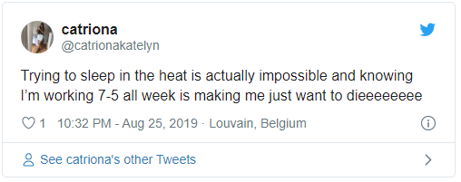
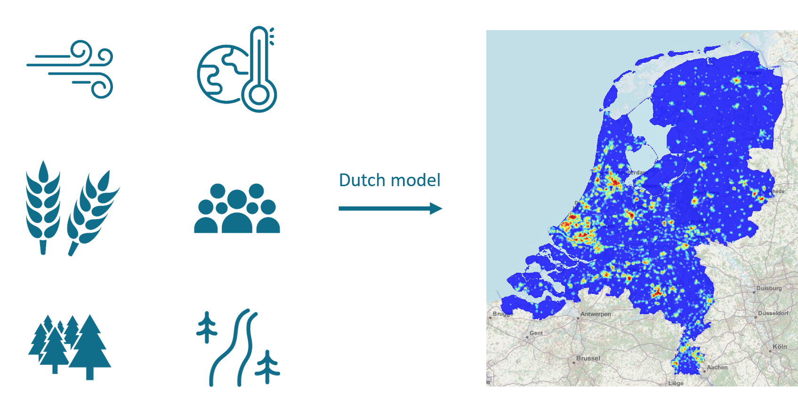
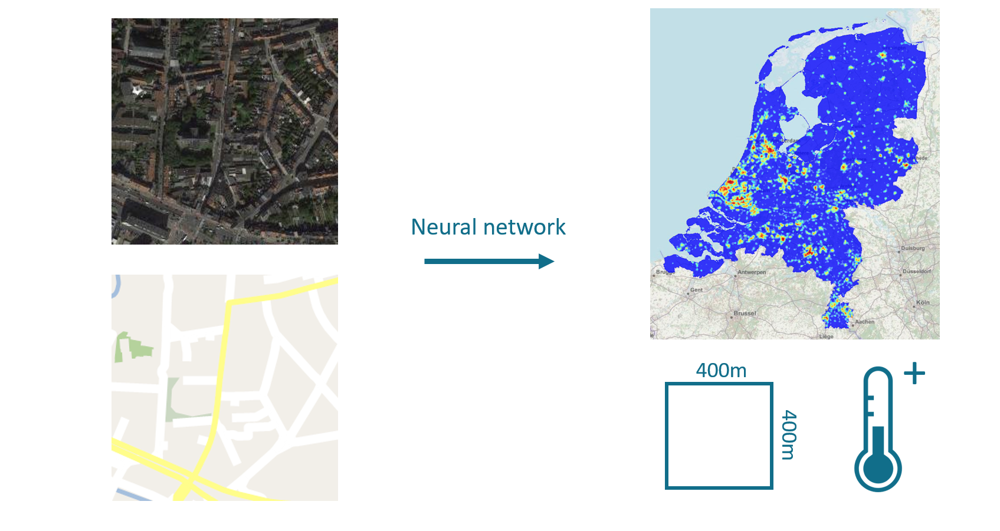
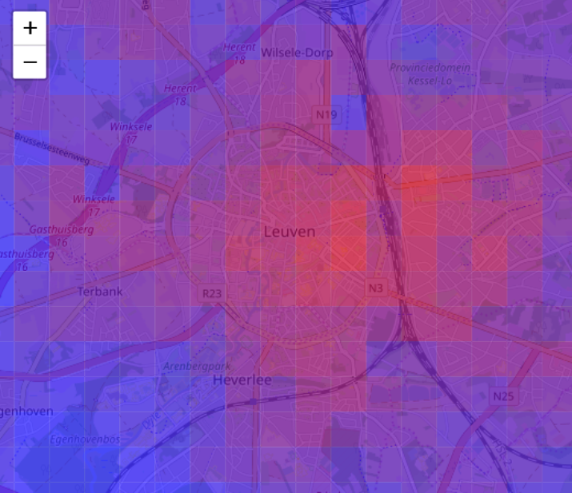
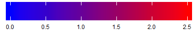
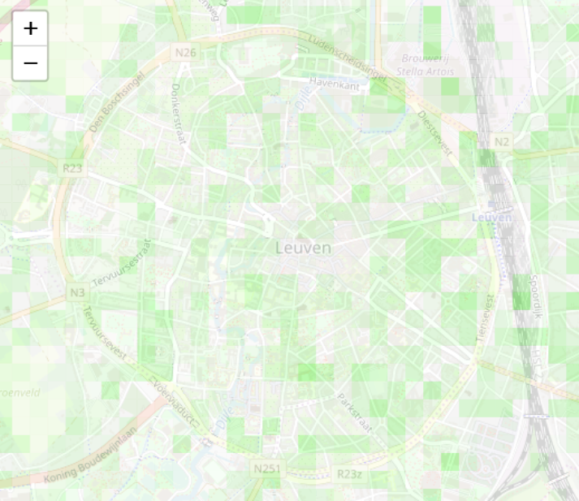
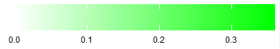
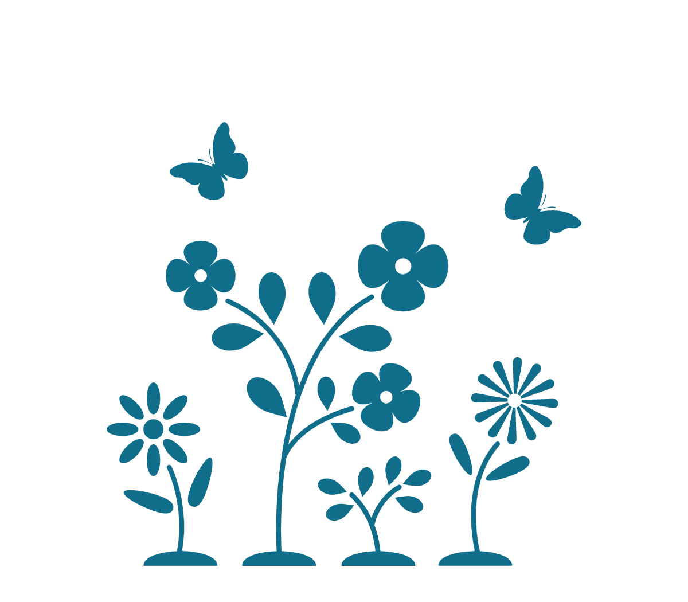

class: clear

```{r knitr, include = FALSE}
library(knitr)
opts_chunk$set(digits = 3, fig.path = "Images/neural_networks_")
evaluate_r = TRUE

library(fontawesome)

# colors - I copied most of these from # https://github.com/edrubin/EC524W20
dark2 <- RColorBrewer::brewer.pal(8, name = "Dark2")
KULbg <- "#116E8A"
red_pink   = "#e64173"
turquoise  = "#20B2AA"
orange     = "#FFA500"
red        = "#fb6107"
blue       = "#3b3b9a"
green      = "#8bb174"
grey_light = "grey70"
grey_mid   = "grey50"
grey_dark  = "grey20"
purple     = "#6A5ACD"
slate      = "#314f4f"
```

.center[
 &nbsp; &nbsp; &nbsp; &nbsp;

]


```{r echo = FALSE, fig.align = 'center', fig.width = 12, fig.height = 7, out.height = 350, out.width = 600}
load("data/station_data.RData")
ggplot() + 
  theme_bw() +
  geom_point(aes(sub37$date_time, sub37$temperature, color = 'Leuven center')) +
  geom_point(aes(sub16$date_time, sub16$temperature, color = 'Leuven suburbs')) +
  ggtitle('Temperature Leuven August, 2019') +
  scale_colour_manual('', values = c("#e8562a", "#116E8A"), label=c('City center', 'Suburbs')) +
  ylab('temperature, °C') + xlab('') +
  theme(plot.title = element_text(hjust = 0.5))
```

---
class:clear
<br>

.center[
```{r , echo = FALSE, fig.align = 'center', out.height = 500, out.width = 1000}

```
]

---
class:clear
<br>

.center[
```{r , echo = FALSE, fig.align = 'center', out.height = 500, out.width = 1000}

```
]


---
class:clear
.pull-left[
<br>
.center[
<div style="position:relative; left:50px;">
```{r leaf1, echo=FALSE, warning = FALSE, message = FALSE, backup = TRUE, center = TRUE, out.height = 450, out.width = 520}

```
<br>
```{r, out.height = 50, out.width = 400, center = TRUE, echo = FALSE}

```
</div>
]
]

.pull-right[
.center[
<br>
```{r, fig.height = 5, fig.width = 10, out.height = 200, out.width = 400, center = TRUE, echo = FALSE, message = FALSE, warning = FALSE}

load('data/nn_score.RData')

ggplot() +
  theme_bw() + 
  geom_point(aes(predictions, actual_score), color = "#116E8A") +
  ylab('score model nl') +
  xlab('prediction neural network') +
  ggtitle('out-of-sample evaluation neural network') +
  theme(plot.title = element_text(hjust = 0.5),
        text = element_text(size=20))

```
<br>
<br>
<br>
```{r, fig.height = 4, fig.width = 8, out.height = 200, out.width = 400, center = TRUE, echo = FALSE, message = FALSE, warning = FALSE}
require(tidyverse)

betas <- readRDS('data/lm_betas.rds')
smooth_fit <- loess(beta ~ as.numeric(day), data = betas, span = 0.5)
betas <- betas %>% mutate(smooth = predict(smooth_fit))

betas %>% 
  ggplot(aes(x = day, y = smooth)) + 
  geom_line(color = "#116E8A", size=2) + 
  theme_bw() +
  xlab('') +
  ylab('smooth effect') +
  theme(plot.title = element_text(hjust = 0.5),
        text = element_text(size=20)) +
  ggtitle('Calibrated, Leuven by night')
```
]
]
---
class:clear
.pull-left[
.center[
<br>
<div style="position:relative; left:50px;">
```{r leaf2, echo=FALSE, warning = FALSE, message = FALSE, backup = TRUE, center = TRUE, , out.height = 450, out.width = 520}

```
<br>

```{r, out.height = 50, out.width = 400, center = TRUE, echo = FALSE}

```
</div>
]
]
.pull-right[

.center[
 </img> &nbsp;  </img> <br>
.KULbginline[10.000 m²]
]

.center[
 <br>
.KULbginline[400.000 - 800.000]
]

.center[
 <br>
.KULbginline[0.15°C - 0.30°C]
]
]
